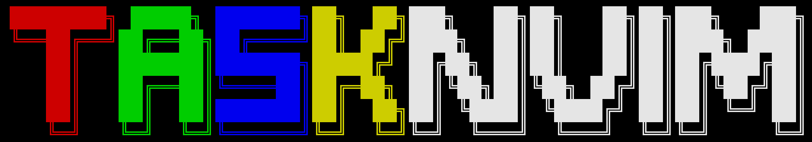
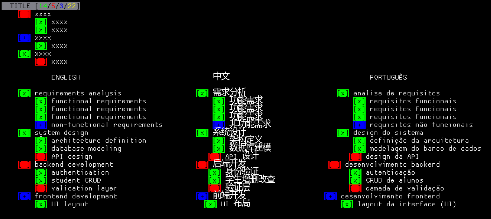
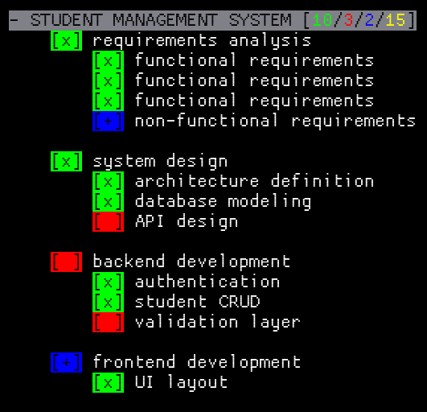

# 📝 tasknvim


A simple and visual Neovim plugin that transforms files into smart task lists, with **automatic counting**, **dynamic highlighting**, and **full color customization**.

---

## 🚀 Introduction

**TASKNVIM** was created to simplify task management directly inside Neovim.<br>
Create a file called **TASKNVIM** and add your tasks.

With it you can:

* ✅ Create task lists organized by sections
* 📊 Automatically track task counts:
  * for the title use - followed by a space '- title'
  * Completed `[x]`
  * Pending `[ ]`
  * In progress `[+]`
* 🎨 Visualize everything with intuitive colors
* ⚡ Automatic updates




---

### ✨ Example

```txt
- Lua Project
  [x] Create structure
  [+] Implement logic
  [ ] Write README
```

⬇️ Automatically becomes:

```txt
- Lua Project [1/1/1/3]
```

---

## 📦 Installation

### Using [lazy.nvim](https://github.com/folke/lazy.nvim)

```lua
{
  "D4F1/tasknvim",
  config = function()
    require("tasknvim").setup({
      green    = "#00FF00",
      red      = "#FF0000",
      blue     = "#0000FF",
      yellow   = "#FFFF00",
      title_fg = "#000000",
      title_bg = "#808080",
    })
  end,
}
```

---

## ⚙️ Configuration & Usage

The plugin uses a custom file type.  
Use files named `TASKNVIM` to automatically enable it.

---

### 🎨 Default Colors

| Option     | Description                      | Default   |
| ---------- | -------------------------------- | --------- |
| `green`    | Completed tasks `[x]`           | `#00FF00` |
| `red`      | Pending tasks `[ ]`             | `#FF0000` |
| `blue`     | In-progress tasks `[+]`         | `#0000FF` |
| `yellow`   | Total count                     | `#FFFF00` |
| `title_fg` | Title text color                | `#000000` |
| `title_bg` | Title background color          | `#808080` |

---

### 🛠️ Customization

```lua
green    = "#00FF00",
red      = "#FF0000",
blue     = "#0000FF",
yellow   = "#FFFF00",
title_fg = "#000000",
title_bg = "#808080",
```

---

✨ Simple, fast, and powerful — all inside your Neovim.

---
## 📄 License


This project is licensed under the MIT License.
