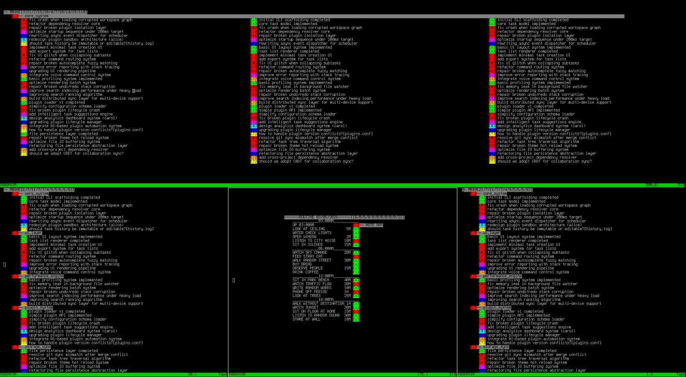
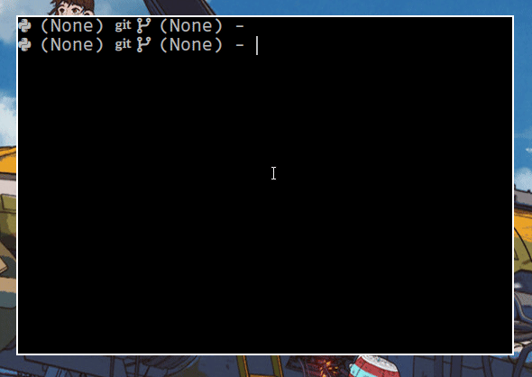

   
A simple and visual Neovim plugin that transforms files into smart task lists, with **automatic counting**, **dynamic highlighting**, and **full color customization**.

## 🚀 Introduction

**TASKNVIM** is a versatile task management plugin for Neovim, designed to organize tasks, todo-lists, project checklists, and any system requiring structured task tracking.<br>
Whether you're managing personal todos, team projects, bug tracking, or any organizational workflow, create a file called **TASKNVIM** and start organizing.
 
<div align="center" style="border:2px solid #FFFFFF;background-color: black; bor">
<br>


   
</div>

<div align="center">

### Task Types
 
<table>
<tr><th>Tag</th><th>Name</th><th>Description</th></tr>
<tr><td><code>[x]</code></td><td>Done</td><td>completed task</td></tr>
<tr><td><code>[ ]</code></td><td>Pending</td><td>priority level 1 task</td></tr>
<tr><td><code>[+]</code></td><td>In Progress</td><td>task in progress</td></tr>
<tr><td><code>[!]</code></td><td>Priority</td><td>priority level 2 task</td></tr>
<tr><td><code>[>]</code></td><td>Max Priority</td><td>priority level 3 task</td></tr>
<tr><td><code>[@]</code></td><td>Delegated</td><td>task assigned to someone (NAME)</td></tr>
<tr><td><code>[?]</code></td><td>Doubt</td><td>question task (question)</td></tr>
<tr><td><code>[#]</code></td><td>Bug</td><td>bug task</td></tr>
<tr><td><code>[/]</code></td><td>Refactor</td><td>refactoring task</td></tr>
<tr><td><code>[*]</code></td><td>Broken</td><td>broken code task</td></tr>
</table>

</div>

## 📦 Installation

### Using [lazy.nvim](https://github.com/folke/lazy.nvim)

```lua
{"DaFi-1/tasknvim"}
```
 
### Using [packer.nvim](https://github.com/wbthomason/packer.nvim)

```lua
use "DaFi-1/tasknvim"
```

### Using [vim-plug](https://github.com/junegunn/vim-plug)

```vim
Plug 'DaFi-1/tasknvim'
```

### Manual Installation

Clone the repository to your Neovim package directory:

```bash
git clone https://github.com/DaFi-1/tasknvim.git ~/.local/share/nvim/site/pack/plugins/start/tasknvim
```
---

## 📄 License

This project is licensed under the GPL License.
