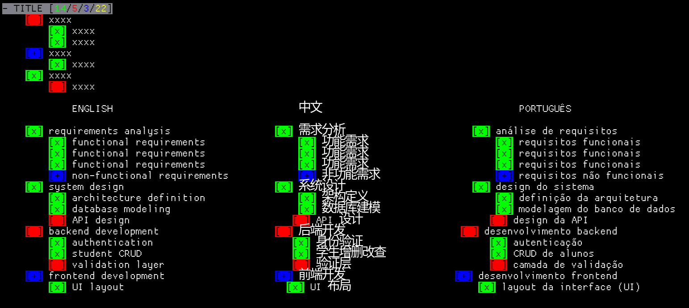
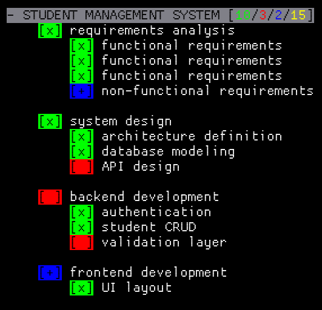

# 📝 tasknvim


A simple and visual Neovim plugin that transforms files into smart task lists, with **automatic counting**, **dynamic highlighting**, and **full color customization**.

## 🚀 Introduction

**TASKNVIM** is a versatile task management plugin for Neovim, designed to organize tasks, todo-lists, project checklists, and any system requiring structured task tracking.<br>
Whether you're managing personal todos, team projects, bug tracking, or any organizational workflow, create a file called **TASKNVIM** and start organizing.

With it you can:

### Task Types

| Tag | Name | Description |
|-----|------|-------------|
| `[x]` | Done | Completed task |
| `[ ]` | Pending | Task not started |
| `[+]` | In Progress | Task currently being worked on |
| `[!]` | Priority | Important task |
| `[>]` | Max Priority | Critical/high priority task |
| `[@]` | Delegated | Task assigned to someone else |
| `[?]` | Doubt | Uncertain or blocked task |
| `[#]` | Bug | Bug fix task |
| `[/]` | Refactor | Code refactoring task |
| `[*]` | Broken | Broken/needs fix task |



---

## 📦 Installation

### Using [lazy.nvim](https://github.com/folke/lazy.nvim)

```lua
{"DaFi-1/tasknvim"}
```
---

## 📄 License

This project is licensed under the MIT License.
